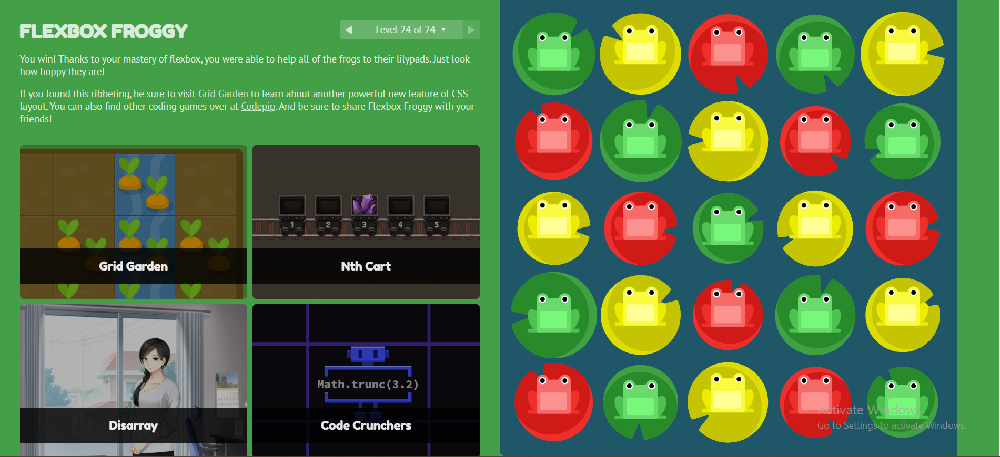

# Flexbox

One of the most challenging aspects is handling responsive design with Flexbox. 

While Flexbox is powerful for creating responsive layouts, it requires a good understanding of how to effectively use media queries in combination with Flexbox properties to adapt layouts to different screen sizes.